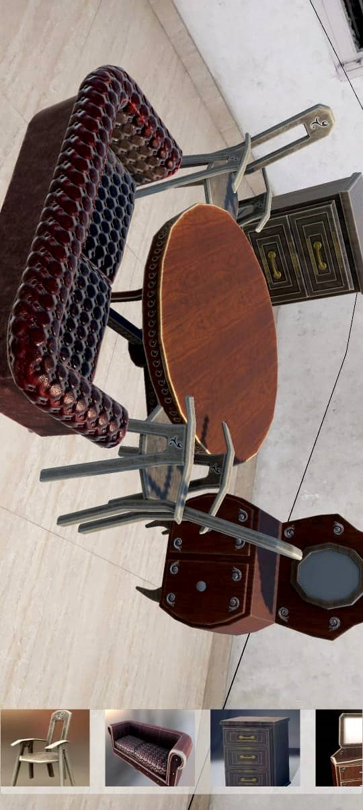

# Space-Styler : AR Furniture Placement App

## Objective

Develop an Augmented Reality (AR) application that allows users to:

- Select furniture from a catalog.
- Place it in a real-world environment.
- Manipulate it using touch gestures (scale, rotate, and translate).

---

## Software and Hardware Requirements

### Software Requirements

- **Unity Hub (2022.3.52f1)**
- **Unity Editor** with the following packages:
  - AR Foundation
  - ARCore XR Plugin
  - XR Core Plugin
  - XR Interaction Toolkit
- **Visual Studio Code/Visual Studio** for scripting.
- **Android SDK**

### Hardware Requirements

- **AR-supported smartphone** (Android).
- **Computer** with 8GB+ RAM.

---

## Features

1. **Furniture Catalog**  
   Select from a variety of 3D furniture models.

2. **Placement**  
   Place furniture models in real-world environments using AR.

3. **Manipulation**

   - **Scale:** Adjust furniture size with pinch-to-zoom gestures.
   - **Rotate:** Rotate furniture using two-finger rotation gestures.
   - **Translate:** Move furniture with a single drag gesture.
   - **Delete:** Remove placed furniture.

4. **Realistic Experience**
   - Furniture snaps to real-world planes (e.g., floors, tables).
   - Includes occlusion for an immersive AR experience.

---

## Implementation Steps

### 1. Setting Up the Project

- Create a new Unity 3D project.
- Install the following packages via Unity's Package Manager:
  - AR Foundation
  - ARCore XR Plugin (for Android)
  - XR Core Plugin
  - XR Interaction Toolkit
- Configure build settings for Android/iOS.

### 2. Import Assets

- Import **https://assetstore.unity.com/packages/3d/props/furniture/furniture-free-pack-192628** from the Unity Asset Store.

---

## Getting Started

### Prerequisites

- Ensure all software and hardware requirements are met.
- Install Unity and set up Android Build Support.

### Installation

1. Clone this repository:
   ```bash
   git clone https://github.com/piyush070920/Space-Styler.git
   ```

## Result



